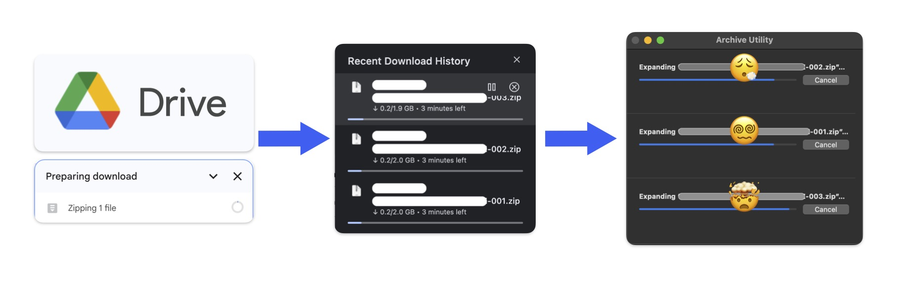
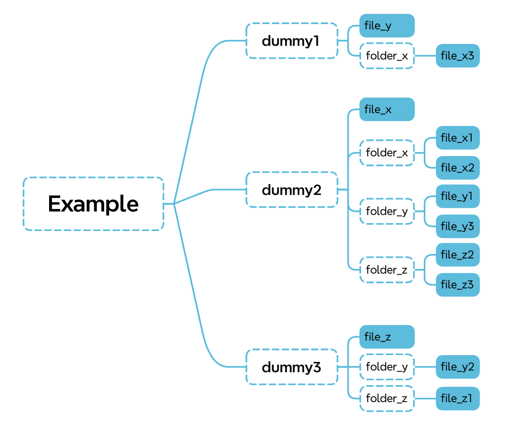
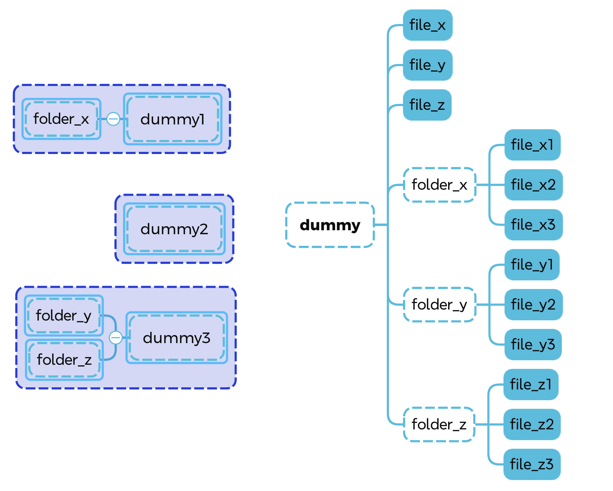

# Google Drive Merge Tool


## Did you know...

Google drive automatically zips your files in a batch while you are downloading a folder from the server because it has this 2GB rule. However this may cause the problem leaving you a stack of files in pieces. 

<p align="center"></p>


## How to use

We are here to help!


Clone the repository

```bash
git clone https://github.com/RandleH/GoogleDriveMerge.git
cd GoogleDriveMerge
```


Merge your files

```bash
python merge.py --dst <your_destination_folder> <source_folder1> <source_folder2> ...
```

> Tips: You can drag the folder to the terminal. It will automatically convert to a string.


## How to use (detailed)


### Command Usage

```bash
python merge.py --dst <your_destination_folder> [--logging <debug|[info]>] [--no-keep] [--force] <source_folder1> <source_folder2> ...
```


| Command     | Role      | Args                 | Description                                                  |
| ----------- | --------- | -------------------- | ------------------------------------------------------------ |
| `--dst`     | Operation | `$path`              | The destination path you want to save                        |
| `--logging` | Option    | `debug` | **`info`** | More verbose if set to debug. Default is `info`              |
| `--no-keep` | Option    |                      | Do not keep the original source files. <br />If set, you will be queried to remove original files or not once done |
| `--force`   | Option    |                      | Any query[Y/N] will be treated as a YES answer               |


### Option `--logging`

```bash
python merge.py --logging debug ... # More verbose
python merge.py --logging info ...  # Default
```


### Option `--no-keep`

```bash
python merge.py --no-keep ... # Do not keep the original source files
```

> We still ask you if you really need to remove the origin or not unless you set the `--force` flag.


### Option `--force`

```bash
python merge.py --force ... # Any query[Y/N] will be treated as a YES answer
```


Any flag that was NOT mentioned above is a required one. User MUST provide at least one.


## Behind the secrets

For demonstration, inside this repository, I provided some dummy files in the `example` folder.

The directory tree looks like this:



Then you may run this command

```bash
python merge.py --dst dummy --copy 0 example/dummy1 example/dummy2 example/dummy3
```

> - Move the original files meaning there will be empty folders remaining.
> - The destination folder is `dummy`. It is at `${YOUR_REPO_DIR}/dummy`
> - The folders to be triaged are `example/dummy1` `example/dummy2` `example/dummy3`


Finally, the result directory tree will be like this:



On the leftside, every original folders became empty and the rightride is your ordered google drive content.


## Give it a 🌟 if you like!


